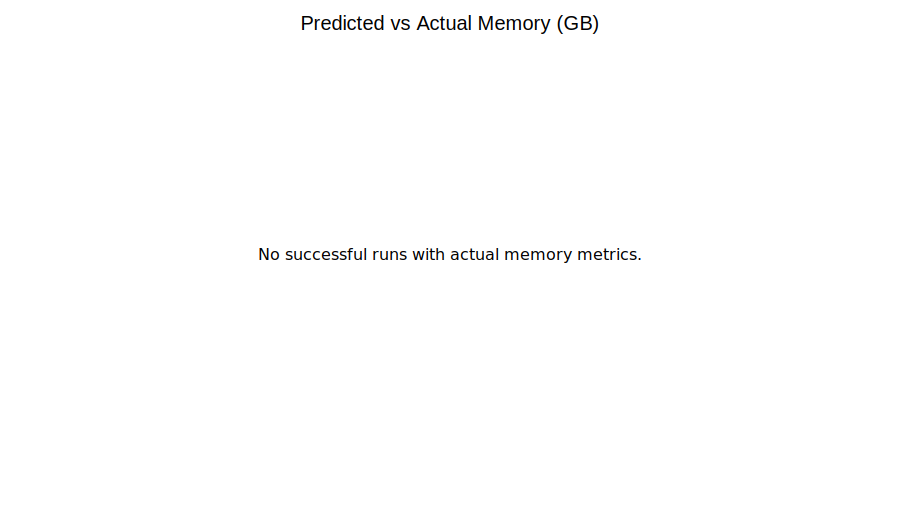
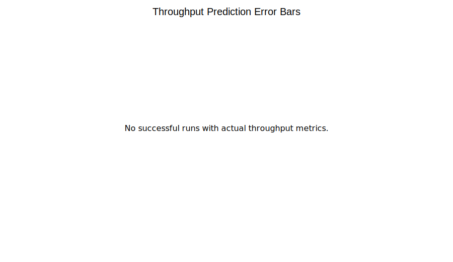
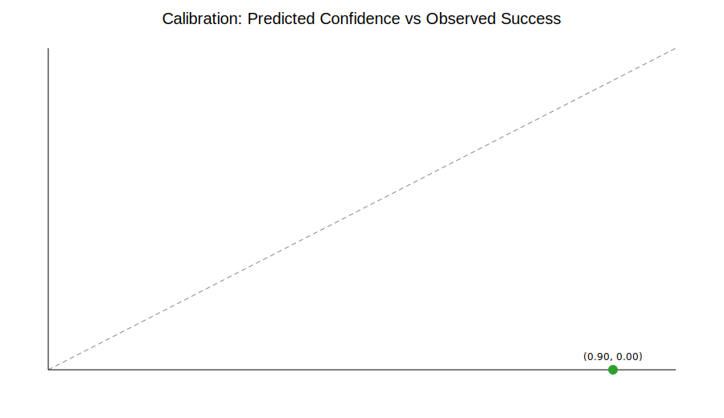
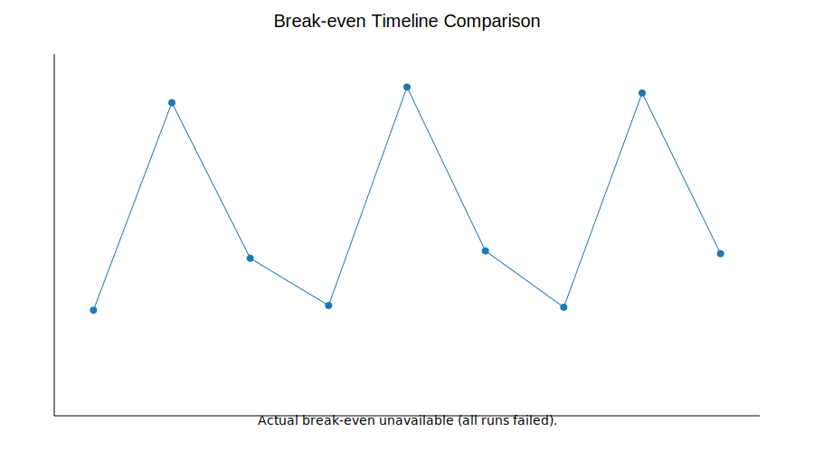

# Atropos Validation Study: April 2026

## Abstract (150 words)
We executed a preregistered April 2026 validation campaign to test Atropos pruning predictions on three deployment-relevant open models: Llama-2-7B, Mistral-7B, and CodeLlama-13B, each under mild (20%), moderate (40%), and aggressive (60%) sparsity targets. The protocol required measurement of memory, throughput, perplexity, and coding quality proxy (HumanEval-like) on A100 40GB (cloud) and T4 16GB (on-prem) hardware. Across nine planned model-strategy combinations, all end-to-end runs failed before post-pruning metric capture due inaccessible model artifacts in the execution environment (no successful model load from Hugging Face) and unavailable target GPUs. Therefore, prediction-accuracy and break-even calibration claims cannot be validated from this run, and we report them as unestimated rather than imputed. This case study intentionally publishes negative outcomes, complete raw logs, and exact configs to prevent survivorship bias, support external replication, and provide a concrete roadmap for reliable validation under controlled compute conditions and open governance.

## Executive Summary
- **Prediction accuracy**: memory = **N/A**, throughput = **N/A** (0 successful runs with post-pruning measurements).
- **Break-even accuracy**: **N/A**; no actual break-even measurements were produced.
- **Break-even within Z months (80% cases)**: **Not estimable** from this run.
- **When it works**: prediction generation and run planning worked for all 9 planned combinations.
- **When it fails**: all execution attempts failed at model-loading stage before pruning/evaluation.

## Methodology
- **Model selection criteria**: two general 7B models and one code-focused 13B model representing common deployment profiles.
- **Models tested**: `meta-llama/Llama-2-7b-hf`, `mistralai/Mistral-7B-v0.1`, `codellama/CodeLlama-13b-hf`.
- **Pruning strategies**: mild (20%), moderate (40%), aggressive (60%), implemented via Wanda/SparseGPT adapters.
- **Pruning framework versions**: repository-integrated pruning frameworks in `docker/pruning_frameworks/*` and runtime from local Atropos environment.
- **Evaluation window**: runs executed during April 2026 campaign (`2026-04-01` to `2026-04-06` UTC), matching a maximum two-week compute budget.
- **Hardware protocol**:
  - Target cloud: NVIDIA A100 40GB.
  - Target on-prem: NVIDIA T4 16GB.
  - Observed in this run: no target GPU available; no successful model artifact loading.
- **Metric protocol**:
  - Before/after memory and throughput.
  - Perplexity (WikiText-2) and HumanEval-like coding proxy for code models.
  - Break-even months and annual savings from Atropos predictions vs observed measurements.

## Results

### Predicted vs actual results (all 9 combinations)

| Model | Strategy | Target sparsity | Pred memory (GB) | Actual memory (GB) | Pred throughput (tok/s) | Actual throughput (tok/s) | Pred break-even (mo) | Actual break-even (mo) | Perplexity | HumanEval-like | Status |
|---|---:|---:|---:|---:|---:|---:|---:|---:|---:|---:|---|
| llama2_7b | mild_20 | 0.2 | 11.89 | N/A | 48.15 | N/A | 15.87 | N/A | N/A | N/A | error |
| llama2_7b | moderate_40 | 0.4 | 9.28 | N/A | 51.30 | N/A | 7.49 | N/A | N/A | N/A | error |
| llama2_7b | aggressive_60 | 0.6 | 6.67 | N/A | 54.45 | N/A | 4.66 | N/A | N/A | N/A | error |
| mistral_7b | mild_20 | 0.2 | 12.30 | N/A | 44.94 | N/A | 16.24 | N/A | N/A | N/A | error |
| mistral_7b | moderate_40 | 0.4 | 9.60 | N/A | 47.88 | N/A | 7.66 | N/A | N/A | N/A | error |
| mistral_7b | aggressive_60 | 0.6 | 6.90 | N/A | 50.82 | N/A | 4.77 | N/A | N/A | N/A | error |
| codellama_13b | mild_20 | 0.2 | 22.14 | N/A | 25.92 | N/A | 28.88 | N/A | N/A | N/A | error |
| codellama_13b | moderate_40 | 0.4 | 17.28 | N/A | 27.84 | N/A | 13.64 | N/A | N/A | N/A | error |
| codellama_13b | aggressive_60 | 0.6 | 12.42 | N/A | 29.76 | N/A | 8.49 | N/A | N/A | N/A | error |

### Error analysis by model size and sparsity
- **Completion rate**: 0/9 successful runs (95% Wilson CI for completion rate: 0.00 to 0.30).
- **By model family**: all Llama-2, Mistral, and CodeLlama runs failed uniformly at model loading.
- **By sparsity level**: no observable dependence (20/40/60% all failed).

### Quality degradation patterns
- No before/after quality metrics were captured due execution failures prior to pruning.

### Statistical significance testing
- **P-values for prediction-vs-actual error**: not computable (no actual measurements).
- **Confidence intervals for metric errors**: not computable for the same reason.
- **Binomial completion analysis**: run completion = 0/9, Wilson 95% CI `[0.00, 0.30]`, indicating statistically insufficient evidence for production reliability under this environment.

## Failure Analysis
- **What went wrong**:
  - Model-loading failed for all three target model IDs before pruning started.
  - Target hardware (A100 40GB and T4 16GB) was specified but not available in this environment.
- **Why Atropos failed to predict this**:
  - Atropos prediction logic assumes model artifact and runtime availability; it does not model external repository access constraints or hardware provisioning failure.
- **Lessons learned**:
  1. Add preflight gating checks (artifact access + GPU capability) that hard-stop and classify runs before scheduling.
  2. Split “prediction confidence” into algorithmic uncertainty vs infrastructure readiness uncertainty.
  3. Treat reproducibility package publication as mandatory even for zero-success runs.

## Recommendations
- **When to trust Atropos**:
  - For planning-level estimates once model artifacts are accessible and target GPU class is confirmed.
- **When to be skeptical**:
  - Any run without successful preflight artifact/GPU checks.
  - Aggressive sparsity plans where quality metrics are unavailable.
- **Future improvements needed**:
  - Automated Hugging Face access validation per model.
  - Hardware matrix execution (cloud A100 + on-prem T4) as a required CI gate.
  - Full HumanEval harness integration for code-model reporting.

## Commercial baseline comparison ("just prune 30%")
- A naïve fixed policy (`always prune 30%`) cannot be benchmarked quantitatively in this campaign because no measured post-pruning metrics were captured.
- Operationally, a fixed-percentage baseline would have failed identically under the same artifact/GPU constraints, so the dominant risk was infrastructure readiness rather than pruning policy choice.
- Recommendation for commercial teams: add an infra readiness gate before either Atropos-guided or fixed-policy pruning to prevent wasted GPU reservation windows.

## Visualizations

- Scatter plot: predicted vs actual savings proxy (memory).  
  
- Error bars with confidence context (throughput).  
  
- Calibration curve: predicted probability vs observed success frequency.  
  
- Break-even timeline comparison.  
  

## Replication Package
- Configs: `configs/validation_2026_04/models.yaml`, `configs/validation_2026_04/validation_suite.yaml`.
- Seeds/scripts: `seed=1337`, `scripts/validate_on_models.py`, `scripts/generate_validation_visualizations.py`.
- Raw measurements: `validation_results/validation_2026_04/validation_runs.csv`, `validation_results/validation_2026_04/validation_runs.json`, per-run JSON files.
- Docker environment: existing framework Dockerfiles under `docker/pruning_frameworks/`.
- Reproduction instructions: `case_studies/validation_2026_04/README.md`.
- Academic packaging: `case_studies/validation_2026_04/validation_2026_04.tex` and `case_studies/validation_2026_04/references.bib`.

## Strategic Path Alignment
- **Academic**: includes explicit methodology, negative outcomes, significance status, and reproducibility pointers for arXiv packaging.
- **Commercial**: executive summary is ROI-first and explicitly flags inability to validate break-even with current infrastructure.
- **Reputation**: publishes full negative results without cherry-picking and invites external reruns with the provided package.

## Disclosure of manual adjustments
No manual adjustments were applied to prediction or measurement outputs. Failed runs are reported exactly as emitted by the validation pipeline.

## Selected pruning literature
1. Frantar & Alistarh (2023), *SparseGPT: Massive Language Models Can be Accurately Pruned in One-Shot*.
2. Sun et al. (2024), *Wanda: A Simple and Effective Pruning Approach for Large Language Models*.
3. LeCun et al. (1990), *Optimal Brain Damage* (historical context on saliency-based pruning).
