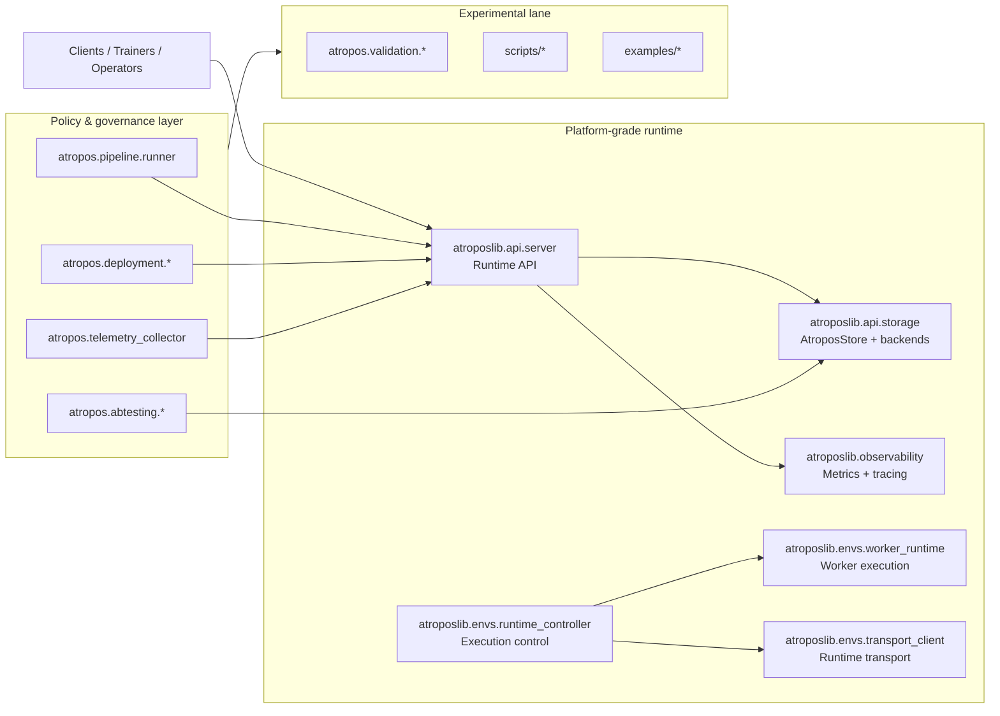

# RFC: Reposition Atropos from Research Framework to Platform Architecture
> Terminology follows the canonical glossary: `/docs/canonical-glossary.md`.

- **Status:** Proposed
- **Authors:** Atropos maintainers
- **Last updated:** 2026-04-18
- **Target release window:** 2026 Q2–Q4
- **Audience:** Maintainers, runtime operators, integration teams

## 1. Context and decision

Atropos currently presents a mixed identity:

- ROI and modeling toolkit (`src/atropos/*`),
- runtime API and environment execution stack (`src/atroposlib/*`),
- and a large set of experimental, validation, and benchmark utilities (`tests/*`, `scripts/*`, `examples/*`).

This has enabled rapid iteration, but it blurs boundaries between **platform contracts** and **research velocity paths**.

**Decision:** Reposition Atropos to a **platform architecture** with explicit service contracts, reliability objectives, and compatibility guarantees, while preserving a clearly labeled experimental lane.

This RFC is intentionally grounded in the current repository structure and existing components; it does not assume a greenfield rewrite.

## 2. Current baseline in-repo (starting point)

The architecture already includes platform-leaning building blocks:

1. **Runtime service surface:** `src/atroposlib/api/server.py`
   - health/readiness/dependency endpoints,
   - queue write path (`/jobs`),
   - scored data ingest/list endpoints,
   - idempotency behavior via headers,
   - tiered hardening model (`research-safe`, `internal-team-safe`, `production-safe`).

2. **Storage abstraction:** `src/atroposlib/api/storage.py`
   - `AtroposStore` protocol as backend contract,
   - `InMemoryStore` and `RedisStore` implementations,
   - startup/dependency health metadata,
   - scored-data lifecycle records and queue metrics.

3. **Runtime control/execution layers:** `src/atroposlib/envs/*`
   - runtime controller, worker manager/runtime, server manager,
   - transport client and distributed execution seams.

4. **Observability primitives:** `src/atroposlib/observability.py`, `src/atropos/telemetry.py`, `src/atropos/telemetry_collector.py`
   - trace/metric hooks and telemetry ingestion.

5. **Research + modeling stack:** `src/atropos/calculations.py`, `src/atropos/pipeline/*`, `src/atropos/validation/*`, `scripts/*`, `examples/*`.

The repositioning work is to codify these into platform-grade vs experimental categories and apply operational guarantees accordingly.

## 3. Stable core services (platform contract)

The following services become the **stable platform core**.

### 3.1 Runtime API service (stable)

**Source anchor:** `src/atroposlib/api/server.py`

Responsibilities:

- Accept and validate runtime writes (`/jobs`, `/scored_data`, `/scored_data_list`).
- Provide health semantics (`/health`, `/health/live`, `/health/ready`, `/health/dependencies`).
- Export metrics (`/metrics`).
- Enforce hardening tier policy (auth, CORS, reset behavior).

Platform contract:

- Endpoint paths and top-level response envelope fields are stable.
- Hardening tiers remain stable and additive.
- Write endpoints must continue to support idempotency via `X-Idempotency-Key` or `X-Request-ID` semantics.

### 3.2 Storage service contract (stable)

**Source anchor:** `src/atroposlib/api/storage.py`

Responsibilities:

- Define backend interface (`AtroposStore`) for queue/state/scored data.
- Persist lifecycle status for ingestion groups.
- Expose startup and dependency health states for readiness gating.

Platform contract:

- `AtroposStore` protocol methods and semantic behavior are stable.
- `RuntimeStatusRecord`, `IngestScoredDataResult`, `QueuedGroupStatusRecord`, `QueueMetrics`, and `StoreStartupState` are stable data contracts.
- Backends can be added, but must conform to protocol semantics.

### 3.3 Runtime orchestration service (stable)

**Source anchor:** `src/atroposlib/envs/runtime_controller.py` and adjacent `envs/*` modules.

Responsibilities:

- Coordinate environment execution, worker lifecycles, and transport operations.
- Apply retries/timeouts/backpressure around environment/runtime boundaries.

Platform contract:

- Runtime controller interfaces and adapter boundaries are stable.
- Transport and worker lifecycle state transitions are stable by behavior, even when internals change.

### 3.4 Observability service (stable)

**Source anchor:** `src/atroposlib/observability.py` and runtime API middleware.

Responsibilities:

- Emit request metrics and queue depth signals.
- Provide trace spans for ingest/fetch operations.
- Expose scrapeable metrics endpoint.

Platform contract:

- Core metric families and labels used for SLOs are stable (additive-only evolution).
- Trace span names for core runtime actions are stable.

## 4. Storage model

Atropos adopts a two-class storage model tied to existing implementations.

### 4.1 Control-plane state (authoritative)

- Queue state, job status, ingest idempotency maps, and group lifecycle records are authoritative control-plane state.
- Production tier uses durable backend (`RedisStore`) and startup dependency checks.
- Non-production tiers may use `InMemoryStore` for local iteration.

### 4.2 Data-plane records (append-oriented)

- Scored records are ingested in groups and stored by environment.
- Group lifecycle transitions (`accepted -> buffered -> batched -> delivered -> acknowledged`) are modeled explicitly.
- Reads are bounded (`limit`) and treated as operational feeds, not analytical warehouse interfaces.

### 4.3 Storage invariants

1. Idempotent write behavior by request key is mandatory.
2. Lifecycle states are monotonic.
3. Readiness reflects both process state and dependency health.
4. Backend substitution cannot alter API-visible semantics.

## 5. Runtime model

Atropos runtime is standardized as a layered model using existing modules.

1. **Ingress Layer** (`atroposlib.api.server`): HTTP validation, auth, idempotency, and request metrics.
2. **State Layer** (`atroposlib.api.storage`): durable/non-durable queue and scored-data lifecycle persistence.
3. **Execution Layer** (`atroposlib.envs.runtime_controller`, `worker_runtime`, `distributed_execution`): workload orchestration.
4. **Environment Adapter Layer** (`atroposlib.envs.base`, `cli_adapter`, `runtime_interfaces`): scenario-specific execution integration.
5. **Governance/Analysis Layer** (`atropos.pipeline`, `atropos.validation`, `atropos.abtesting`): policy and decision workflows consuming runtime outputs.

Runtime design principles:

- Keep ingress/control semantics deterministic.
- Isolate environment-specific behavior behind adapters.
- Preserve replayability through explicit status transitions and structured logs.

## 6. Reliability expectations (platform SLO/SLI posture)

The platform posture is "explicitly reliable by tier," derived from existing hardening tiers.

### 6.1 Tier expectations

- **research-safe:** best-effort local reliability, no auth requirement, reset allowed.
- **internal-team-safe:** authenticated writes, bounded blast radius, durable-like behavior encouraged.
- **production-safe:** durable backend required, strict auth, readiness/dependency gates enforced, no reset endpoint.

### 6.2 Baseline reliability requirements

1. **Availability target (runtime API):** 99.9% monthly for production-safe deployments.
2. **Durability target (control-plane writes):** no acknowledged-write loss across process restart when using durable store.
3. **Idempotency target:** duplicate request keys must not create duplicate accepted work.
4. **Readiness correctness target:** `/health/ready` must fail when dependency health fails.
5. **Graceful shutdown target:** runtime declares non-ready before store shutdown.

### 6.3 Failure behavior requirements

- Backpressure returns explicit 429/503 style responses when queue/state limits are reached.
- Partial failures in multi-group ingest must return accepted/failed counts deterministically.
- Dependency outage must degrade to not-ready, never silently healthy.

## 7. Observability requirements

### 7.1 Required telemetry signals

1. **Request metrics:** method/path/status/duration for all API routes.
2. **Queue metrics:** queue depth and oldest age.
3. **Ingestion metrics:** accepted counts, dedupe rates, failed groups.
4. **Dependency health metrics:** dependency healthy/unhealthy status.
5. **Lifecycle traces:** ingest and trainer fetch spans.

### 7.2 Required logs

Structured JSON logs with minimum fields:

- `request_id`, `endpoint`, `status_code`, `duration_seconds`, `env_id`, `batch_id` (when applicable).

### 7.3 Required operational artifacts

- Production dashboard coverage for API latency/error and queue health.
- Alerting rules for readiness failures, dependency health failures, and sustained ingest failure rates.

## 8. Compatibility guarantees

Atropos platform compatibility is formalized into three bands.

### 8.1 Platform-grade (SemVer protected)

- Runtime API routes and top-level response keys in `atroposlib.api.server`.
- Storage contract method set and data class field names in `atroposlib.api.storage`.
- Runtime hardening tier enum names and policy intent.
- Core observability metric names/labels used in shipped dashboards.

Breaking changes require:

- major release increment,
- migration guide in `docs/`,
- deprecation window of at least one minor release when technically possible.

### 8.2 Beta (evolving with migration notes)

- Extended runtime controllers and distributed execution internals (`atroposlib.envs.*`).
- Plugin server integrations (`atroposlib.plugins.*`).

Guarantee: best-effort backward compatibility; migration notes required for notable behavior changes.

### 8.3 Experimental (no compatibility guarantee)

- Validation experiments (`src/atropos/validation/*` beyond promoted APIs).
- Benchmark/helper scripts in `scripts/*`.
- Example-only flows under `examples/*`.
- Exploratory docs and one-off analyses.

Guarantee: may change or be removed without deprecation.

## 9. Platform-grade vs experimental classification in this repo

### 9.1 Platform-grade now (or with minimal hardening)

- `src/atroposlib/api/server.py`
- `src/atroposlib/api/storage.py`
- `src/atroposlib/observability.py`
- `src/atroposlib/envs/runtime_controller.py`
- `src/atroposlib/envs/runtime_interfaces.py`
- `src/atroposlib/envs/transport_client.py`

### 9.2 Candidate platform services (needs hardening)

- `src/atropos/pipeline/runner.py`
- `src/atropos/deployment/strategies.py`
- `src/atropos/deployment/health.py`
- `src/atropos/telemetry_collector.py`

### 9.3 Explicitly experimental/research lane

- `src/atropos/validation/*`
- `scripts/*`
- `examples/*`
- ad hoc notebooks and standalone benchmarking tests.

## 10. Dependency diagram

The canonical dependency diagram is maintained in:

- `docs/diagrams/atropos_platform_dependency.mmd`

Rendered Mermaid source:

## 11. Migration roadmap tied to current repo

### Phase 0 (Week 0-2): Contract inventory and labeling

- Add explicit "platform-grade / beta / experimental" labels to docs and module docstrings for:
  - `src/atroposlib/api/*`
  - `src/atroposlib/envs/*`
  - `src/atropos/validation/*`, `scripts/*`, `examples/*`.
- Create compatibility test matrix for runtime API and storage contracts in `tests/test_api.py`, `tests/test_runtime_server_storage.py`, and `tests/contracts_store_adapters.py`.

**Exit criterion:** Every runtime-facing module has a declared stability tier.

### Phase 1 (Week 2-6): Lock stable contracts

- Freeze Runtime API response envelopes and document them in `docs/api.md`.
- Freeze storage protocol semantics and lifecycle invariants in `docs/runtime_storage_contract_tests.md`.
- Add CI assertions that prevent incompatible field removals in platform-grade dataclasses/endpoints.

**Exit criterion:** Any contract-breaking change fails CI without explicit major-version flag.

### Phase 2 (Week 6-10): Production reliability hardening

- Enforce production-safe deployment checks (durable backend + auth + readiness/dependency gating).
- Add queue pressure policy and explicit overload responses in runtime API.
- Strengthen graceful shutdown and restart recovery paths for durable store.

**Exit criterion:** production-safe profile passes runtime reliability test suite.

### Phase 3 (Week 10-14): Observability completion

- Standardize required runtime logs and correlation fields.
- Normalize metric families and align dashboards in `docs/grafana/*`.
- Add alerting guidance and runbook references in `docs/observability.md`.

**Exit criterion:** SLO dashboard + alerts cover API errors, latency, queue, and dependency health.

### Phase 4 (Week 14-20): Research lane decoupling

- Move experimental helpers behind explicit experimental namespace and docs.
- Ensure `scripts/*` and `examples/*` do not silently depend on platform internals without adapters.
- Add contributor policy: new experimental features must not expand platform-grade contracts by default.

**Exit criterion:** Experimental churn no longer causes platform API/storage compatibility drift.

### Phase 5 (Week 20+): Adoption and deprecation cycle

- Publish migration guides for any renamed/deprecated runtime fields.
- Track adoption on internal examples and deployment manifests.
- Remove deprecated beta paths after deprecation window.

**Exit criterion:** Major adopters use only platform-grade surfaces for production deployments.

## 12. Risks and mitigations

1. **Risk:** Over-classifying unstable modules as stable too early.
   - **Mitigation:** keep env/distributed internals in beta until two release cycles show no compatibility breaks.

2. **Risk:** Slower experimental iteration.
   - **Mitigation:** preserve explicit experimental lane and avoid forcing SemVer guarantees there.

3. **Risk:** Operational burden increases during hardening.
   - **Mitigation:** stage rollout via hardening tiers and phase-based migration plan.

## 13. Acceptance criteria for this RFC

This RFC is accepted when:

1. Stability tier labels are visible in docs and code for core runtime modules.
2. Runtime API + storage compatibility checks are CI-enforced.
3. Production-safe profile documents and enforces minimum reliability and observability requirements.
4. Experimental modules are explicitly marked and excluded from platform compatibility guarantees.
